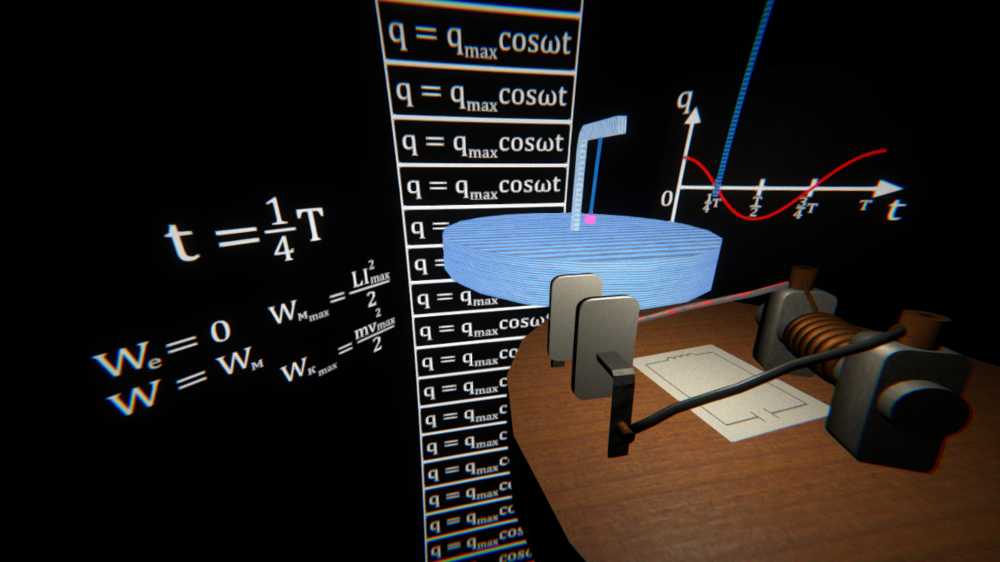

# Pendulums
 A demonstration **(NOT a demoscene production)** for a physics lesson made with Unity.
 Also it's in Ukrainian. And it has some eastereggs in it and a benchmark mode!
 
## Keyboard controls
 Press Esc to end the demo.
 Press left mouse button to pause the demo.
 
## Building
 Unity **2020.1.9f1** or higher is required for building the demo.
 
## System Requirements
 - OS: Windows 7 (32-bit or 64-bit) or higher (Android 7.1 or higher for mobile version)
 - Processor: Intel Core 2 Duo or AMD Athlon X2
 - Graphics Card: Intel HD or equivalent
 - RAM: 2 GB
 
 TL;DR: It runs on a potato. My computer is much better than that!
 
## Screenshots

