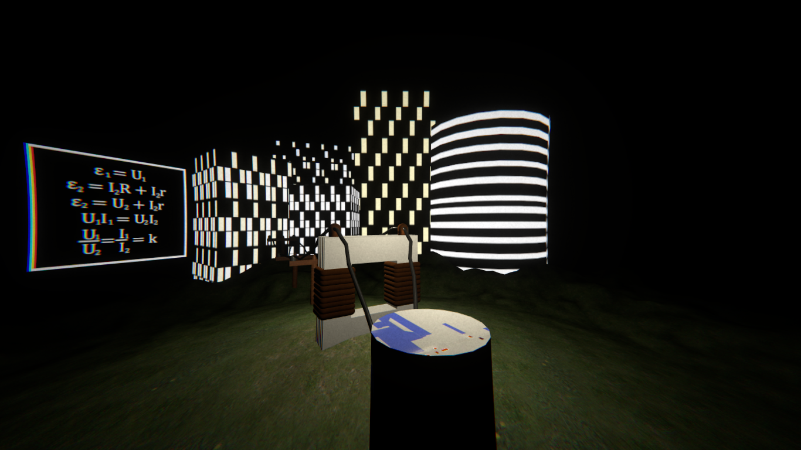
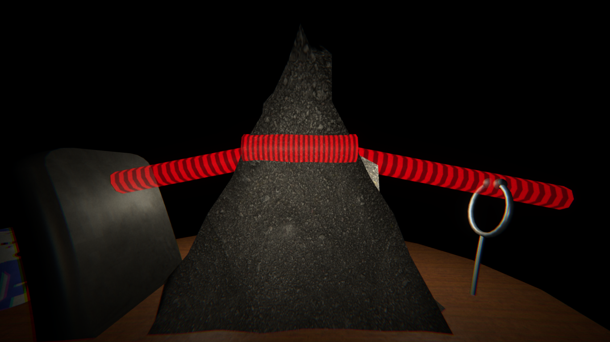
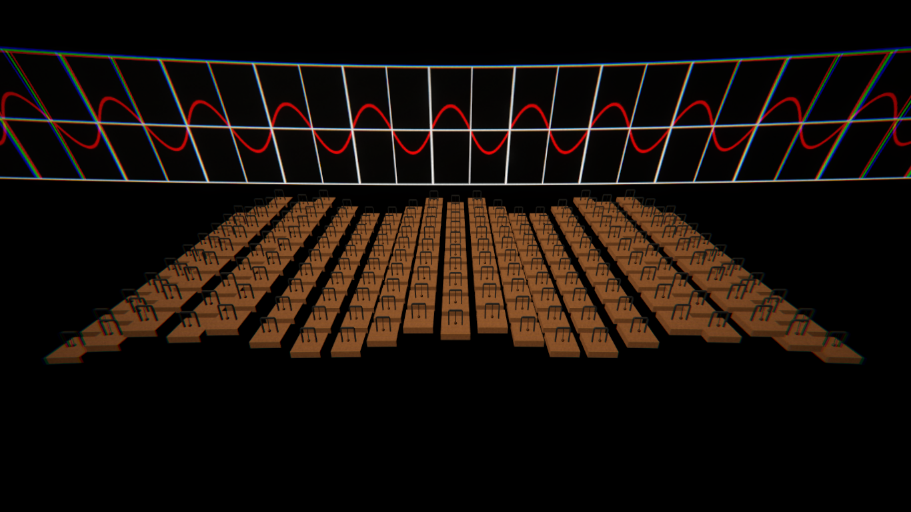

# Pendulums
 A demonstration **(NOT a demoscene production)** for a physics lesson made with Unity.
 Also it's in Ukrainian. And it has some eastereggs in it and a benchmark mode!
 Android 7.1 or higher is required. By the way, I composed the soundtrack for this demo (I used LMMS for this)!
 
## Controls
 Click the "Back" button to end the demo.
 Tap to pause the demo.
 
## Building
 Unity **2020.3.20f1** or higher is required for building the demo.
 
 Since Unity Asset Store EULA doesn't allow me to redistribute Standard Assets package
 you need to [download](https://assetstore.unity.com/packages/essentials/asset-packs/standard-assets-for-unity-2018-4-32351) 
 it yourself. It's free. I used some simple models from Prototyping category. You need to import this package and put Prototyping folder
 into Assets folder.
 
## Screenshots

